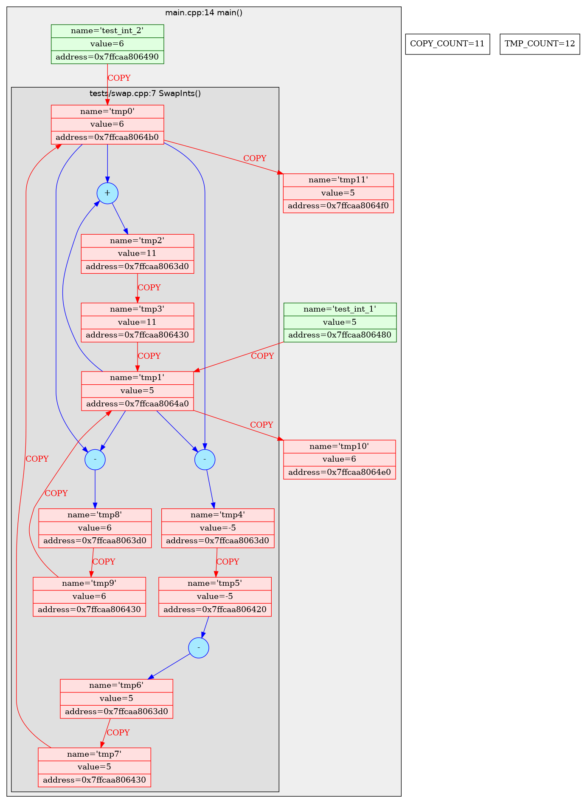
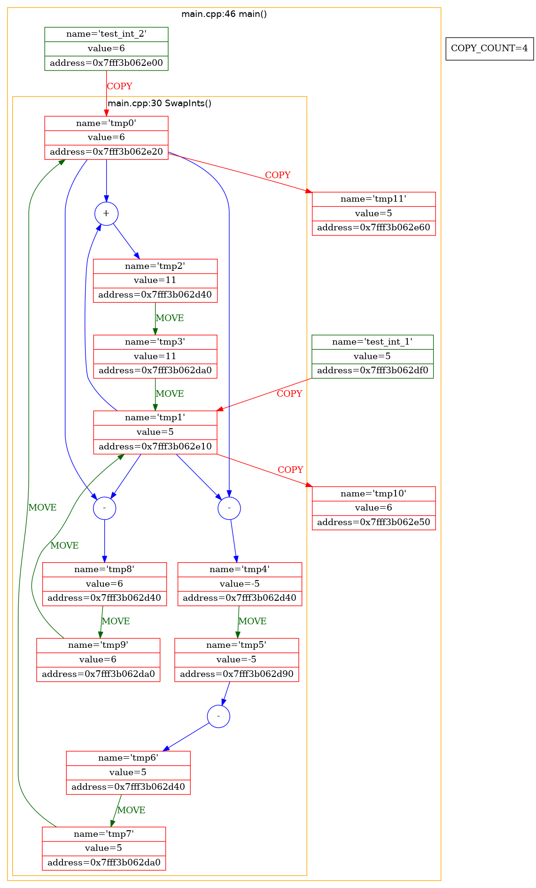
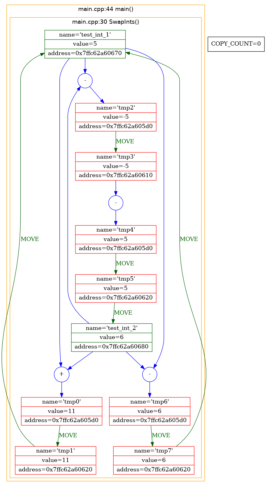
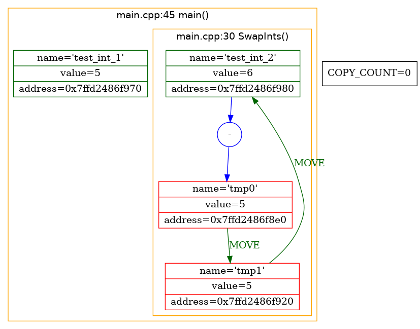

# Move/Copy Semantics

## Copy Semantics
When talking about copy semantics, it is better to differentiate
between shallow copy and deep copy.

### Shallow Copy
In shallow copy, an object is created by simply copying the data of all variables
of the original object. This works well if none of the variables of the object are
defined in the heap section of memory. If some variables are dynamically allocated
memory from heap section, then the copied object variable will also reference the
same memory location. This will create ambiguity and run-time errors, dangling pointer.
Since both objects will reference to the same memory location, then change made by
one will reflect those change in another object as well. Since we wanted to create
a replica of the object, this purpose will not be filled by Shallow copy. 

### Deep Copy
In Deep copy, an object is created by copying data of all variables, and it also
allocates similar memory resources with the same value to the object. In order to
perform Deep copy, we need to explicitly define the copy constructor and assign
dynamic memory as well, if required. Also, it is required to dynamically allocate
~memory to the variables in the other constructors, as well.


## Move Semantics
C++ move constructors use so-called rvalue references. Rvalue references
are basically references to the objects which are soon to be destroyed.
These temporary objects are never to be used by the user again, thus they
can serve us as a trash can where we store all the useless data.
In move constructors we can always use shallow copying. That is why
move constructors are usually a better choice when talking about perfomance.

## Note
I am not going to take T(T&) and T(const T&&) into account as they
both don't make sense. The first one is dangerous because it can quite
easily modify the source if it was not originally const and it takes
precedence over the regular copy constructor. The second one is simply
stupid. The dying object says: "I'm dying, take my pointers, I don't need
them anymore". And the constructor answers: "No, I can’t do that, they are
yours and will remain with you, I can only make a copy".

## Example
Let's now consider a simple algorithm of swapping two integers (DemoInts actually).

### First Approach


As we can see here, with move constructors disabled we get a rather
unpleasing picture. Copy counter as well as the number of tmp
variables surpsass 11. Pretty expensive as for 4 lines of code, isn't it?

### Allow Move Constructors
But now take a look at what we get when we allow move semantics.



What we see now is a dramatic drop in amount of copies (more than twice as good!).
Although, the amount of tmps stays on the same level.

### Pass Arguments By Reference
We now can improve the algorithm by passing the argument by
reference rather than by value.



What we get now is 0 copies and only 7 temporary variables. But
there's always a roow for improvement! Let's now use direct assignment
operations instead of arithmetics.

### Assignment Operators


Great job! At the end we geet zero copies and a couple of temporary objects.

## Result
To summarize, the copy constructor makes a deep copy, because the source
must remain untouched. The move constructor, on the other hand, can just copy
the pointer and then set the pointer in the source to null. It is okay to "nullify"
the source object in this manner, because the client has no way of inspecting the object again.

# Move/Forward

In the course of our previous conversation let's consider the
following example:

```
void foo() {
    <...>
    std::vector<int> temp(1000);
    Fill(temp);
    Storage storage;
    storage->Write(temp);
    <...>
}

void Storage::Write(std::vector&& temp) {
    <...>
}

void Storage::Write(std::vector& temp) {
    <...>
}

```

As we can see, there are two version of the same method Storage::Write.
One accepts rvalue reference, and the other - lvalue reference. In this particular
case it would be preferable to use the first form of the function because it would
simply make a shallow copy of the temporary vector object. In order to achieve it
we need to commit a cast like so:

```
void foo() {
    <...>
    std::vector<int> temp(1000);
    Fill(temp);
    Storage storage;
    storage->Write(static_cast<std::vector<int>&&>(temp));
    <...>
}
```

But isn't it too clumsy and inconvinient to always type 'static_cast<...>'.
And this is the reason for std::move() function to appear. std::move() is
destined to convert evrything into rvalue refernce. This is how aforementioned
example would look with the use of std::move():

```
void foo() {
    <...>
    std::vector<int> temp(1000);
    Fill(temp);
    Storage storage;
    storage->Write(std::move(temp));
    <...>
}
```

Much better, isn't it? But we can't always use std::move(). Sometimes we need to
pass the information about the initial type of the variable. For instance:

```
template <typename T>
void foo(T&& var) {
    bar(var);
}
```

Here for some reason we need to remain the type of 'var' for call of bar(). And this
is where std::forward() enters in. It would simply return T& in case of arguemt of type T&. The
same goes for T&&. See how handy it comes:

```
template <typename T>
void foo(T&& var) {
    bar(std::forward<T>(var));
}
```

## Note

Note that in the previous example foo() function uses a so-called universal reference.
It works according to the reference compression rule:

```
T& && = T&
T&& & = T&
T& & = T&
T&& && = T&&
```

## Examples

But seeing something once in practice is always better that hearing about it
fot a thousand times. Therefore, consider [this](https://github.com/XDLoLiK/move-copy-lab/blob/master/tests/std_forward_test.cpp)
simple example. Of course, swapping this much of vectors is something far-fetched, but
the perfomance boost we get from using std::move instead of std::forward is
ridiculous: 163ms vs 39921ms (~245 times faster).

The same goes for std::forward. There is no doubt that higher perfomance is great, but who
needs it when your programm [SIGFAULTs](https://github.com/XDLoLiK/move-copy-lab/blob/master/tests/std_move_test.cpp) anyways)

## Conclusion

To sum up, std::move ans std::forward both are useful instruments which can possibly
make your programm better. But in hands of an unexperienced developper they can lead
to unwanted consequences.
